# unified-remark-prismjs

> Syntax highlighter for markdown code blocks using Prism (modified from [remark-prism](https://www.npmjs.com/package/remark-prism)), **use with remark-rehype**


- added some features

1. filename
2. line highlight
3. language tag
4. copy button
5. refine the attribute syntax

## installation

```bash
npm i unified-remark-prismjs
```

## usage

```js

const src = `
\`\`\`javascript
console.log('Hello World');
\`\`\`
`;

```

```javascript
require('unified')()
  .use(require('remark-parse'))
  .use(require('unified-remark-prismjs'), {
    /* options */
  })
  .use(require('remark-rehype'))
  .use(require('rehype-format'))
  .use(require('rehype-stringify'))
  .process(src, (err, file) => console.log(String(file)));
```

- output

```html
<div class="remark-highlight">
  <pre class="language-javascript">
    <code>
      <span class="token console class-name">console</span>
      <span class="token punctuation">.</span>
      <span class="token method function property-access">log</span>
      <span class="token punctuation">(</span>
      <span class="token string">'Hello World'</span>
      <span class="token punctuation">)</span>
      <span class="token punctuation">;</span>
    </code>
  </pre>
</div>
```

## Don't forget to import styles

- base style && prismjs theme style

```css
@import url('unified-remark-prismjs/src/style.css');
@import url('prism-themes/themes/prism-base16-ateliersulphurpool.light.min.css');
```

- prismjs plugins style have been used


```css
@import url('prismjs/plugins/line-numbers/prism-line-numbers.css');
@import url('prismjs/plugins/inline-color/prism-inline-color.min.css');
@import url('prismjs/plugins/diff-highlight/prism-diff-highlight.min.css');
@import url('prismjs/plugins/treeview/prism-treeview.min.css');
@import url('prismjs/plugins/command-line/prism-command-line.min.css');
@import url('prismjs/plugins/show-invisibles/prism-show-invisibles.min.css');
```
## attributes in syntax

> you can use any one you like

```

```js{2,3}
```js {2,3}
```js {2, 3}


```js{2,3}[attrname=xxx][class=xxx]
```js {2,3}[attrname=xxx][class=xxx]
```js [attrname=xxx]{2,3}[class=xxx]
```js {2,3}[attrname=xxx class=xxx]
```js [attrname=xxx class=xxx]{2,3}


```js [attrname=xxx class=xxx]
```js [class=xxx]

```js {2,3}[attrname=xxx class="xxx1 xxx2 xxx3"]
```js {2,3}[attrname=xxx][class="xxx1 xxx2 xxx3"]
```js {2,3}[attrname=xxx][class="xxx1"][class="xxx2 xxx3"]
```js [attrname=xxx][class="xxx1"]{2,3}[class="xxx2 xxx3"]
```js{2,3}[attrname=xxx][class="xxx1"][class="xxx2"][class="xxx3"]

```

## full usage

> see [test.md](https://github.com/jerrywu001/unified-remark-prismjs/tree/main/src/example/test.md)

```bash
git clone git@github.com:jerrywu001/unified-remark-prismjs.git

cd unified-remark-prismjs

npm i

npm run play
```

## options

```js
use(require('unified-remark-prismjs'), {
  showLanguage: true, // show language tag
  enableCopy: true, // show copy button
  plugins: [], // some prismjs plugins
})
```

## options.plugins

```js
use(require('unified-remark-prismjs'), {
  plugins: [
    'autolinker',
    'show-invisibles',
    'data-uri-highlight',
    'diff-highlight',
    'inline-color',
    'line-numbers',
    'command-line',
    'treeview',
  ],
});
```

## Instructions

**import base style**

```css
@import url('unified-remark-prismjs/src/style.css');
@import url('prism-themes/themes/prism-base16-ateliersulphurpool.light.min.css');
```

- language tag

```js

use(require('unified-remark-prismjs'), {
  showLanguage: true, // show language tag
})

```

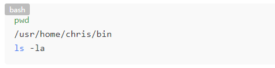

---

- enabled copy

```js

use(require('unified-remark-prismjs'), {
  enableCopy: true, // show copy button
})

```
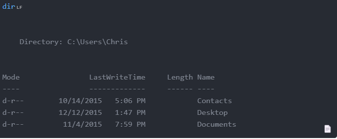

---

- filename

```md

```js[xxx/xxx.js]

```

or

```md

```js[filename=xxx/xxx.spec.js]

```

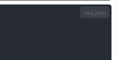

---

- line highlight

```md

```js{1,3-5}

```

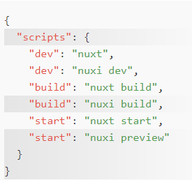

---

## Instructions for plugins

- autolinker

```js
use(require('unified-remark-prismjs'), {
  plugins: [
    'autolinker',
  ],
});
```

**then import plugin style**

```css
@import url('prismjs/plugins/autolinker/prism-autolinker.css');
```

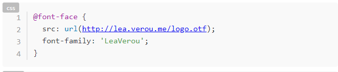

---

- data-uri-highlight

```js
use(require('unified-remark-prismjs'), {
  plugins: [
    'data-uri-highlight',
  ],
});
```

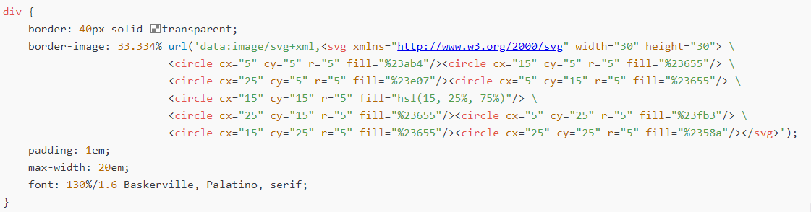

---

- inline-color

```js
use(require('unified-remark-prismjs'), {
  plugins: [
    'inline-color',
  ],
});
```

**then import plugin style**

```css
@import url('prismjs/plugins/inline-color/prism-inline-color.min.css');
```

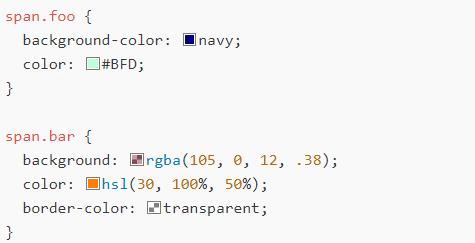

---

- line-numbers

```js
use(require('unified-remark-prismjs'), {
  plugins: [
    'line-numbers',
  ],
});
```

**then import plugin style**

```css
@import url('prismjs/plugins/line-numbers/prism-line-numbers.css');
```

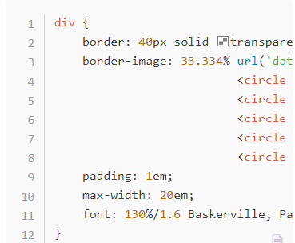


**Line numbers will not used**

```

```js[class=no-line-numbers]

```

---

- diff-highlight

```js
use(require('unified-remark-prismjs'), {
  plugins: [
    'diff-highlight',
  ],
});
```

**then import plugin style**

```css
@import url('prismjs/plugins/diff-highlight/prism-diff-highlight.min.css');
```

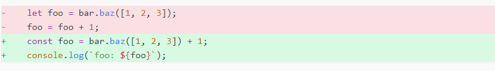

---

- treeview

```js
use(require('unified-remark-prismjs'), {
  plugins: [
    'treeview',
  ],
});
```

**then import plugin style**

```css
@import url('prismjs/plugins/treeview/prism-treeview.min.css');
```

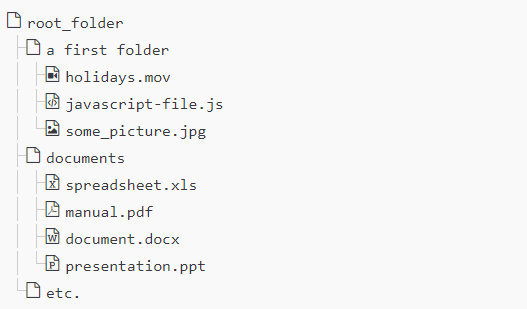

---

- command-line

```js
use(require('unified-remark-prismjs'), {
  plugins: [
    'command-line',
  ],
});
```

**then import plugin style**

```css
@import url('prismjs/plugins/command-line/prism-command-line.min.css');
@import url('prismjs/plugins/show-invisibles/prism-show-invisibles.min.css');
```

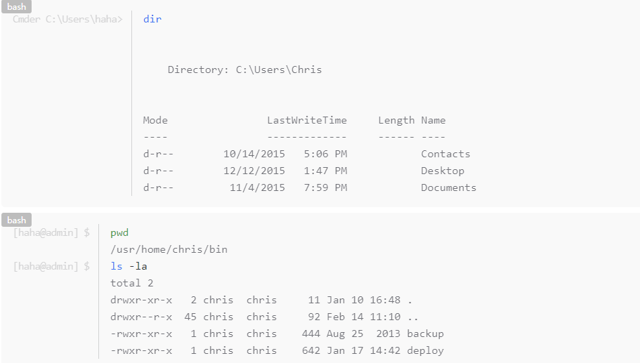


**command line will not used**

```

```js[class=no-command-line]

```

---

- show-invisibles

```js
use(require('unified-remark-prismjs'), {
  plugins: [
    'show-invisibles',
  ],
});
```

**then import plugin style**

```css
@import url('prismjs/plugins/show-invisibles/prism-show-invisibles.min.css');
```

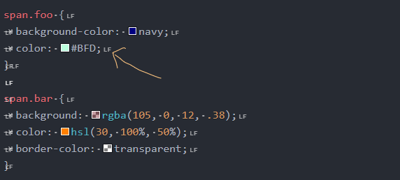
